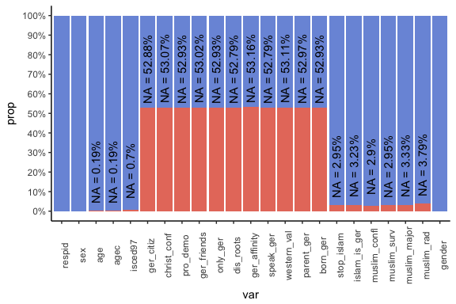
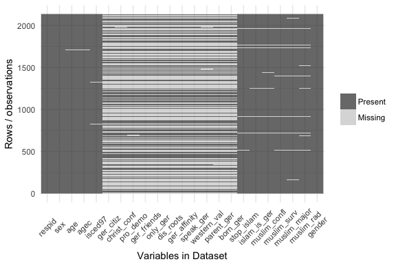
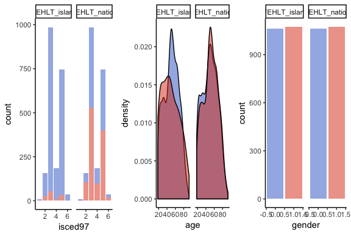

SEM 2
================
Simon Roth
21.4.2017


Itembatterien
-------------

**Islamophobie:**

-   mm01: ISLAMAUSUEBUNG IN BRD BESCHRAENKEN
    -   -10 Befragter gehört einer islamischen Religionsgemeinschaft an (Code 1 in rd03)
    -   -9
    -   1 Stimme überhaupt nicht zu
    -   2
    -   3
    -   4
    -   5
    -   6
    -   7 Stimme voll und ganz zu
-   mm02: ISLAM PASST IN DIE DEUTSCHE GESELLSCHAFT
-   mm03: ANWESENHEIT VON MUSLIMEN BRINGT KONFLIKT
-   mm04: STAAT SOLLTE ISLAM. GRUPPEN BEOBACHTEN
-   mm05: MUSLIMISCHER BUERGERMEISTER IN ORDNUNG
-   mm06: UNTER MUSLIMEN SIND VIELE REL. FANATIKER

**Nationalbewusstsein:**

-   mn11: DEUTSCH SEIN: DEUTSCHE STAATSBUERGERSCH.
-   mn12: DEUTSCH SEIN: CHRISTL.RELIGION ZUGEHOER.
-   mn13: DEUTSCH SEIN: BEKENNTNIS ZUR DEMOKRATIE
-   mn14: DEUTSCH SEIN: VIELE DEUTSCHE BEKANNTE
-   mn15: DEUTSCH SEIN: ALTE STAATSANGEH.AUFGEBEN
-   mn16: DEUTSCH SEIN: VERBUNDENHEIT ZU DEUTSCHL.
-   mn17: DEUTSCH SEIN: ALTE GEBRAEUCHE ABLEGEN
-   mn18: DEUTSCH SEIN: GUT DEUTSCH SPRECHEN
-   mn19: DEUTSCH SEIN: WESTLICHE WERTE TEILEN
-   mn20: DEUTSCH SEIN: MIND. 1 ELTERNTEIL DEUTSCH
-   mn21: DEUTSCH SEIN: IN DEUTSCHLAND GEBOREN

Daten partitionieren
====================

-   sex: GESCHLECHT (Int.: Geschlecht der befragten Person ohne Befragen eintragen!)
    -   1 Männlich
    -   2 Weiblich
-   age: ALTER: metrisch
-   agec: ALTER: KATEGORISIERT 6
    -   18 - 29 Jahre
    -   30 - 44 Jahre
    -   45 - 59 Jahre
    -   60 - 74 Jahre
    -   75 - 89 Jahre
    -   Über 89 Jahre
-   isced97: BEFR.: ISCED 1997 - 6 STUFEN: International Standard Classification of Education (ISCED) 1997, 6 Stufen
    1.  Level - Primary education or first stage of basic education
    2.  Level - Lower secondary or second stage of basic education
    3.  Level - (Upper) secondary education
    4.  Level - Post-secondary non-tertiary education
    5.  Level - First stage of tertiary education
    6.  Level - Second stage of tertiary education
-   Allgemeiner Bildungsabschluss?

Missing Pattern
---------------

NZ (Fragebogen- Split): Befragter hat aufgrund eines methodischen oder inhaltlichen Splits eine Frage oder Item- batterie nicht gestellt bekommen.



Little Test
-----------

*A Test of Missing Completely at Random for Multivariate Data with Missing Values* Roderick J. A. Little (1988)

**Nullhypothesis: missing values pattern are missing completly at random**

``` r
# install.packages("BaylorEdPsych")
# install.packages("mvnmle")

library(BaylorEdPsych)
little_islam <- LittleMCAR(islam)
little_islam$amount.missing
little_islam$p.value

little_nation <- LittleMCAR(nation)
little_nation$amount.missing
little_nation$p.value
```

2.2 T-Tests
-----------



2.3 Logistic Regression
-----------------------

<table style="text-align:center">
<caption>
<strong>Logistic Regression for Missing Values</strong>
</caption>
<tr>
<td colspan="3" style="border-bottom: 1px solid black">
</td>
</tr>
<tr>
<td style="text-align:left">
</td>
<td>
<strong>FEHLT\_nation</strong>
</td>
<td>
<strong>FEHLT\_islam</strong>
</td>
</tr>
<tr>
<td style="text-align:left">
</td>
<td>
<strong>Model 1</strong>
</td>
<td>
<strong>Model 2</strong>
</td>
</tr>
<tr>
<td colspan="3" style="border-bottom: 1px solid black">
</td>
</tr>
<tr>
<td style="text-align:left">
gender
</td>
<td>
1.007
</td>
<td>
1.066
</td>
</tr>
<tr>
<td style="text-align:left">
</td>
<td>
(1.092)
</td>
<td>
(1.206)
</td>
</tr>
<tr>
<td style="text-align:left">
age
</td>
<td>
1.005
</td>
<td>
0.994
</td>
</tr>
<tr>
<td style="text-align:left">
</td>
<td>
(1.003)
</td>
<td>
(1.005)
</td>
</tr>
<tr>
<td style="text-align:left">
isced97
</td>
<td>
0.949
</td>
<td>
0.727
</td>
</tr>
<tr>
<td style="text-align:left">
</td>
<td>
(1.042)
</td>
<td>
(1.096)
</td>
</tr>
<tr>
<td style="text-align:left">
Constant
</td>
<td>
1.131
</td>
<td>
0.256
</td>
</tr>
<tr>
<td style="text-align:left">
</td>
<td>
(1.239)
</td>
<td>
(1.543)
</td>
</tr>
<tr>
<td style="text-align:left">
N
</td>
<td>
2116
</td>
<td>
2116
</td>
</tr>
<tr>
<td style="text-align:left">
Log Likelihood
</td>
<td>
-1455.950
</td>
<td>
-464.681
</td>
</tr>
<tr>
<td style="text-align:left">
AIC
</td>
<td>
2919.900
</td>
<td>
937.362
</td>
</tr>
<tr>
<td colspan="3" style="border-bottom: 1px solid black">
</td>
</tr>
<tr>
<td colspan="3" style="text-align:left">
<sup>***</sup>p &lt; .01; <sup>**</sup>p &lt; .05; <sup>*</sup>p &lt; .1
</td>
</tr>
</table>
